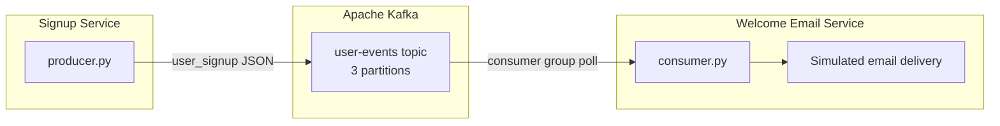
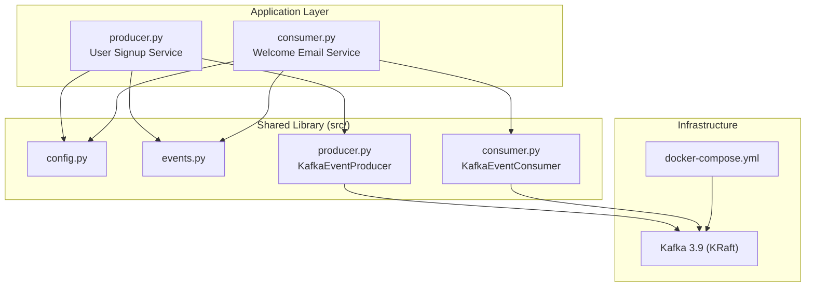
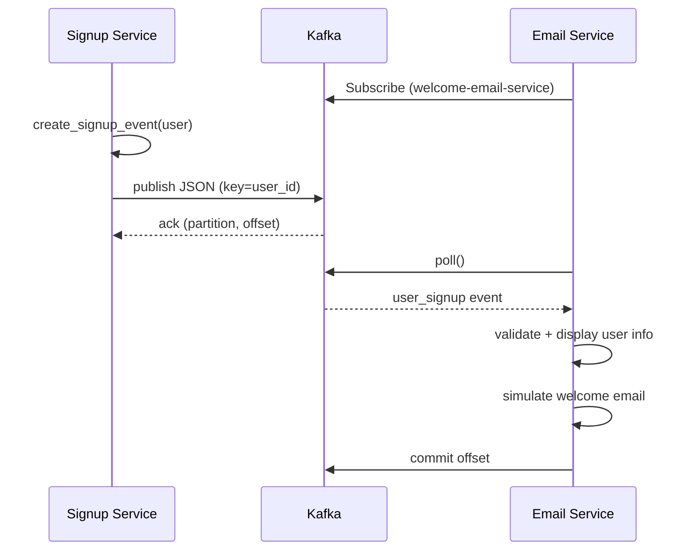

# Kafka Producer & Consumer System — Architecture

## System overview

Event-driven user signup pipeline built with **Apache Kafka** and **Python**.



**Producer → Kafka Topic → Consumer**

---

## Component diagram



---

## Message flow



---

## Event schema

```json
{
  "event_type": "user_signup",
  "event_id": "evt-a1b2c3d4",
  "user_id": "u-2001",
  "name": "Alice Smith",
  "email": "alice@example.com",
  "plan": "free",
  "timestamp": "2026-06-10T14:00:00Z"
}
```

---

## Project structure

```
kafka-producer-consumer-system/
├── producer.py              # Signup service entry point
├── consumer.py              # Welcome email service entry point
├── docker-compose.yml       # Local Kafka broker
├── requirements.txt
├── src/                     # Shared library
│   ├── config.py            # Broker, topics, retry settings
│   ├── events.py            # Event schemas and sample data
│   ├── producer.py          # KafkaEventProducer class
│   └── consumer.py          # KafkaEventConsumer class
├── scripts/
│   ├── setup.ps1            # Environment setup
│   └── run-demo.ps1         # Demo orchestration
├── docs/
│   └── CURRICULUM.md        # Topics 01–09 learning path
└── topic-*/                 # Hands-on exercises (Topics 01–10)
```

---

## Key design decisions

| Decision | Rationale |
|----------|-----------|
| **Kafka as message bus** | Decouples signup from email — services scale independently |
| **JSON events** | Human-readable, easy to debug, universal format |
| **Consumer groups** | Track offsets; multiple consumers can share load |
| **Retry with backoff** | Handle transient broker failures gracefully |
| **Partition keys (user_id)** | Same user's events route to the same partition for ordering |
| **KRaft mode** | Modern Kafka without Zookeeper dependency |

---

## Technology stack

| Layer | Technology |
|-------|------------|
| Message broker | Apache Kafka 3.9 (KRaft) |
| Client library | kafka-python |
| Language | Python 3.10+ |
| Containerization | Docker Compose |
| Serialization | JSON (UTF-8) |

---

## Scaling path

| Stage | Change |
|-------|--------|
| **Current (demo)** | 1 producer, 1 consumer, 1 broker |
| **Development** | Multiple consumer instances in same group |
| **Production** | Multi-broker cluster, replication factor 3, schema registry |
| **Extended** | Add consumers for analytics, CRM, fraud detection on same topic |
