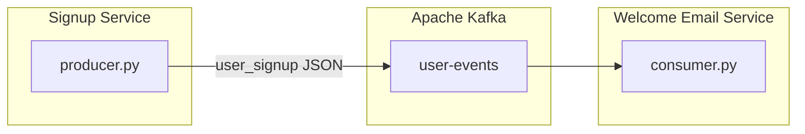

# Kafka Producer & Consumer System

An event-driven **user signup pipeline** built with **Apache Kafka** and **Python**. Demonstrates how producers and consumers communicate through Kafka topics without direct service coupling.

```
Signup Service  →  user-events (Kafka)  →  Welcome Email Service
```


---

## Features

- **Kafka producer** — publishes structured `user_signup` JSON events
- **Kafka consumer** — subscribes to topics, parses events, processes welcome emails
- **Event-driven architecture** — decoupled services via message bus
- **Error handling** — connection retries with exponential backoff
- **Docker Compose** — local Kafka 3.9 broker (KRaft mode, no Zookeeper)
- **Clean codebase** — shared `src/` library with config, events, producer, and consumer modules
- **Full curriculum** — 10 hands-on topics from Kafka basics to portfolio deployment

---

## Architecture



See [ARCHITECTURE.md](ARCHITECTURE.md) for detailed diagrams and design decisions.

---

## Quick start

### Prerequisites

- [Docker Desktop](https://www.docker.com/products/docker-desktop/)
- Python 3.10+

### Setup

```powershell
git clone https://github.com/YOUR_USERNAME/kafka-producer-consumer-system.git
cd kafka-producer-consumer-system

# Start Kafka + create topics + install Python deps
.\scripts\setup.ps1

# Activate virtual environment
.\.venv\Scripts\Activate.ps1
```

### Run the demo

**Terminal 1 — Welcome Email Service (start first):**

```powershell
python consumer.py
```

**Terminal 2 — Signup Service:**

```powershell
python producer.py
```

The producer registers **5 users**. The consumer receives each signup and simulates a welcome email.

Or use the demo script:

```powershell
.\scripts\run-demo.ps1
```

---

## Project structure

```
kafka-producer-consumer-system/
├── producer.py              # Signup Service entry point
├── consumer.py              # Welcome Email Service entry point
├── docker-compose.yml       # Local Kafka broker
├── requirements.txt
├── src/                     # Shared library
│   ├── config.py            # Broker, topics, retry settings
│   ├── events.py            # Event schemas and validation
│   ├── producer.py          # KafkaEventProducer class
│   └── consumer.py          # KafkaEventConsumer class
├── scripts/
│   ├── setup.ps1            # One-command setup
│   └── run-demo.ps1         # Demo instructions
├── ARCHITECTURE.md          # System diagrams
├── PROJECT_SUMMARY.md       # Portfolio summary
├── docs/CURRICULUM.md       # Learning path (Topics 01–09)
└── topic-*/                 # Hands-on exercises
```

---

## Event schema

```json
{
  "event_type": "user_signup",
  "event_id": "evt-a1b2c3d4",
  "user_id": "u-2001",
  "name": "Alice Smith",
  "email": "alice@example.com",
  "plan": "free",
  "timestamp": "2026-06-10T14:00:00Z"
}
```

---

## Sample output

**Producer:**

```
==================================================
  USER SIGNUP SERVICE — Event Producer
==================================================

Registering: Alice Smith (alice@example.com)
14:00:01 [INFO] Event published | type=user_signup | topic=user-events | offset=0
...
  5/5 signup events published to 'user-events'
```

**Consumer:**

```
  NEW USER SIGNUP RECEIVED
  Name      : Alice Smith
  Email     : alice@example.com
  [EMAIL] Subject : Welcome to our platform, Alice!
  [EMAIL] Status  : SENT
```

---

## Learning curriculum

| Topic | Focus |
|-------|-------|
| 01 | Kafka basics — producer, topic, consumer |
| 02 | Local Kafka setup with Docker |
| 03 | Create and manage topics |
| 04 | Simple Python producer |
| 05 | Simple Python consumer |
| 06 | End-to-end pipeline demo |
| 07 | JSON structured events |
| 08 | Error handling and retries |
| 09 | Mini final demo — signup pipeline |
| 10 | Portfolio refactor and GitHub |

Full index: [docs/CURRICULUM.md](docs/CURRICULUM.md)

---

## Key concepts demonstrated

| Concept | Implementation |
|---------|----------------|
| **Producer** | `KafkaEventProducer` publishes JSON to `user-events` |
| **Topic** | `user-events` with 3 partitions |
| **Consumer** | `KafkaEventConsumer` in group `welcome-email-service` |
| **Offsets** | Auto-committed; consumer resumes after restart |
| **Partition key** | `user_id` routes events consistently |
| **Fault tolerance** | Retry with exponential backoff on connect/send |

---

## Troubleshooting

| Issue | Fix |
|-------|-----|
| `NoBrokersAvailable` | Run `docker compose up -d` and wait ~30s |
| `docker` not found | Install and start Docker Desktop |
| No messages in consumer | Reset group: see `scripts/run-demo.ps1` |
| `ModuleNotFoundError` | Activate venv: `.\.venv\Scripts\Activate.ps1` |

---

## Documentation

- [Architecture](ARCHITECTURE.md) — diagrams and design
- [Project summary](PROJECT_SUMMARY.md) — portfolio one-pager
- [Portfolio guide](topic-10-portfolio-review/portfolio-guide.md) — GitHub deployment

---

## License

MIT — free to use for learning and portfolio purposes.

---

*Built as a hands-on project demonstrating event streaming with Apache Kafka.*
