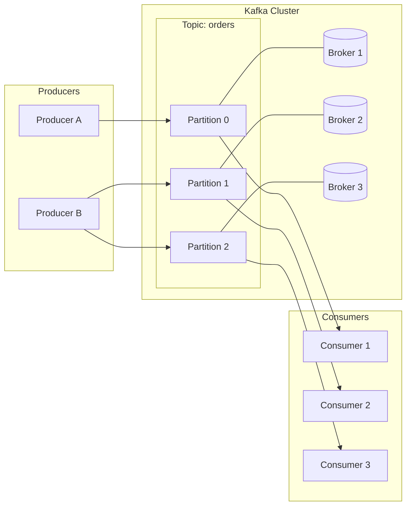
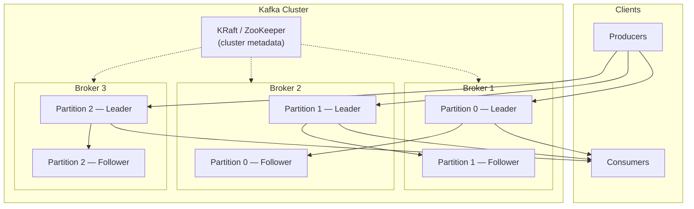
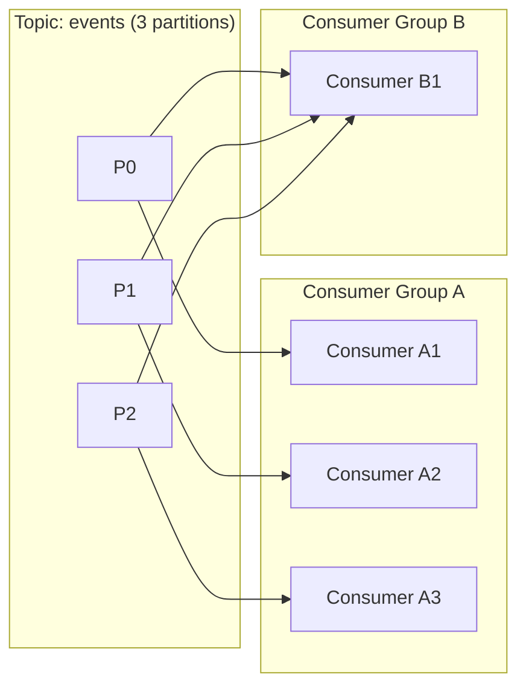

# Kafka Architecture Diagram

## High-level data flow

The core pattern every Kafka system follows:



**Producer → Kafka Topic → Consumer**

| Step | What happens |
|------|----------------|
| 1 | Producers publish records to a topic. |
| 2 | Kafka routes each record to a partition (by key hash or round-robin). |
| 3 | Brokers persist records in partition logs and replicate for fault tolerance. |
| 4 | Consumers in a group read assigned partitions and commit offsets. |

---

## Cluster architecture (brokers, topics, replication)



Each **partition** has one leader (handles reads/writes) and followers that replicate data. If a broker fails, a follower is elected leader so the topic stays available.

---

## Consumer groups



- **Within one consumer group**, each partition is read by **at most one** consumer (load balancing).
- **Different consumer groups** each get **all** messages independently (pub/sub broadcast).

---

## ASCII overview (portable reference)

```
┌─────────────┐     ┌──────────────────────────────────────────┐     ┌─────────────┐
│  Producer   │────▶│  Topic: "user-events"                    │────▶│  Consumer   │
│  (app/API)  │     │  ┌──────────┐ ┌──────────┐ ┌──────────┐ │     │  (service)  │
└─────────────┘     │  │ Part. 0  │ │ Part. 1  │ │ Part. 2  │ │     └─────────────┘
                    │  │ offset:  │ │ offset:  │ │ offset:  │ │
┌─────────────┐     │  │ 0,1,2,…  │ │ 0,1,2,…  │ │ 0,1,2,…  │ │     ┌─────────────┐
│  Producer   │────▶│  └────┬─────┘ └────┬─────┘ └────┬─────┘ │────▶│  Consumer   │
└─────────────┘     │       │            │            │       │     │  (analytics)│
                    │       ▼            ▼            ▼       │     └─────────────┘
                    │   Broker 1    Broker 2    Broker 3      │
                    └──────────────────────────────────────────┘
```

---

## Related reading

- [kafka-concepts.md](kafka-concepts.md) — one-page concept summary and use cases
