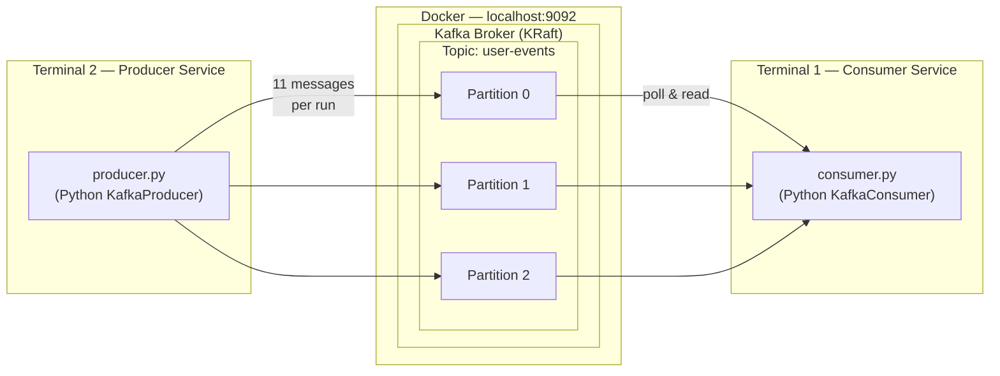
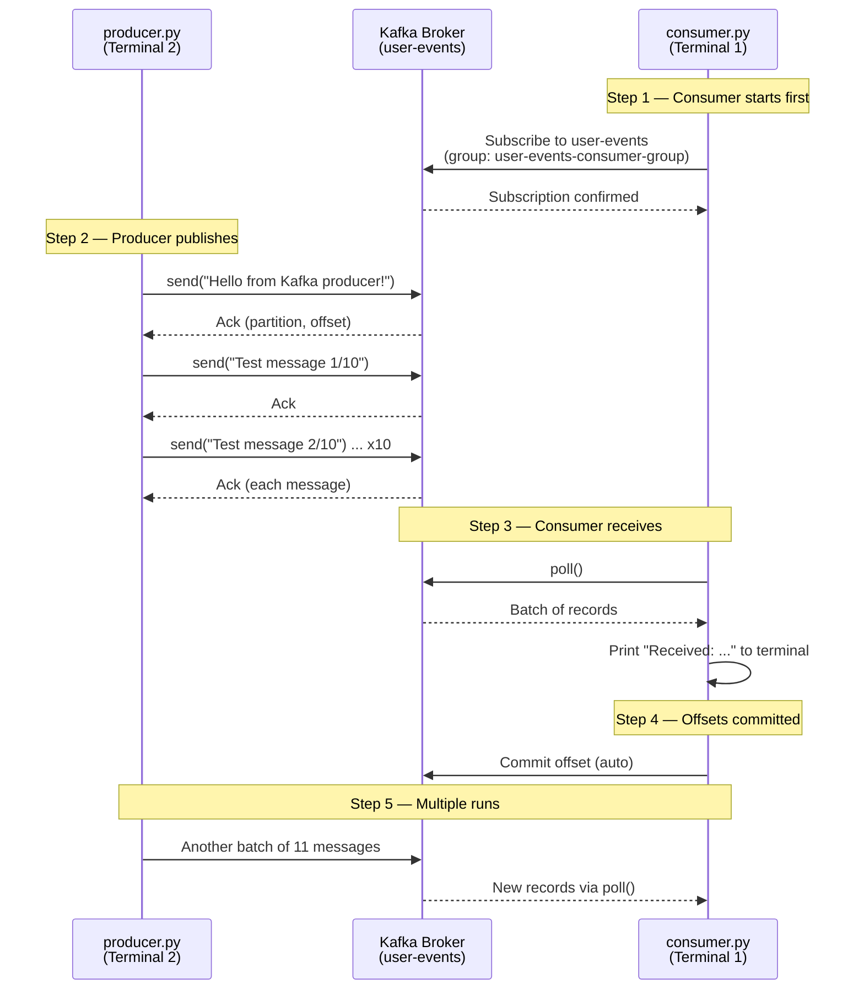
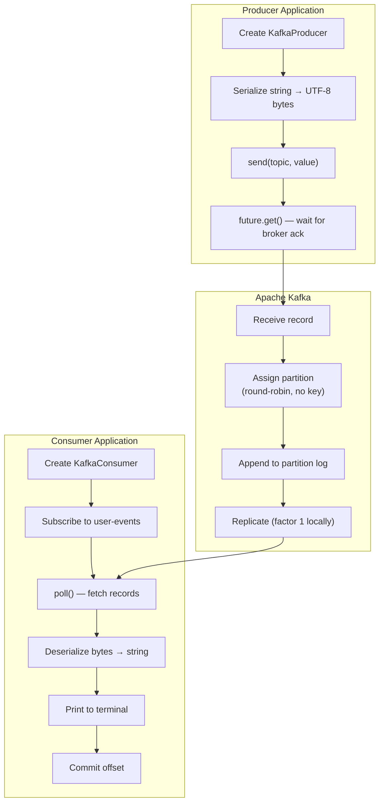
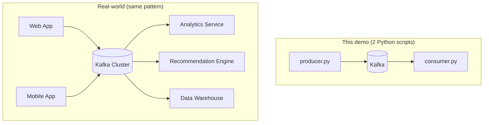

# Topic 06 — Pipeline Architecture Diagram

Complete message flow for the **user-events** end-to-end demo (Topics 04–06).

---

## System overview



**Producer → Kafka Topic → Consumer**

The producer and consumer never talk to each other directly. Kafka sits in the middle as a durable message bus.

---

## Message flow (sequence)

What happens when you run the demo:



---

## Component map

| Component | File | Role |
|-----------|------|------|
| **Kafka broker** | `kafka-producer-consumer/docker-compose.yml` | Stores and serves messages |
| **Topic** | `user-events` (3 partitions) | Named channel for user activity events |
| **Producer** | `topic-04-simple-producer/producer.py` | Publishes text messages to the topic |
| **Consumer** | `topic-05-simple-consumer/consumer.py` | Subscribes and displays messages |
| **Consumer group** | `user-events-consumer-group` | Tracks read progress (offsets) |

---

## Data path detail



---

## ASCII diagram (portable reference)

```
┌─────────────────────────────────────────────────────────────────────────────┐
│                         END-TO-END KAFKA PIPELINE                           │
└─────────────────────────────────────────────────────────────────────────────┘

  TERMINAL 2                         DOCKER                         TERMINAL 1
  ──────────                    ───────────────                    ──────────

┌──────────────┐              ┌─────────────────┐              ┌──────────────┐
│  producer.py │              │  Kafka Broker   │              │ consumer.py  │
│              │   publish    │  localhost:9092 │    poll      │              │
│ KafkaProducer│─────────────▶│                 │◀─────────────│ KafkaConsumer│
│              │              │  Topic:         │              │              │
│ 11 msgs/run  │              │  user-events    │              │ print msgs   │
└──────────────┘              │  ┌────┬────┬────┐ │              └──────────────┘
       │                      │  │ P0 │ P1 │ P2 │ │                     │
       │                      │  └──┬─┴──┬─┴──┬─┘ │                     │
       │                      └─────┼────┼────┼────┘                     │
       │                            │    │    │                          │
       └────────────────────────────┴────┴────┴──────────────────────────┘
                    Messages flow through topic — not direct service calls

  Sent: 'Test message 3/10'  →  stored at partition 1, offset N  →  Received: 'Test message 3/10'
```

---

## How services communicate through Kafka



The demo uses two terminal scripts, but the pattern is identical at scale: **many producers, one topic, many independent consumers**.

---

## Key takeaways

1. **Decoupling** — Producer and consumer only know the topic name and broker address, not each other.
2. **Durability** — Messages persist in the topic log until retention expires.
3. **Scalability** — Partitions allow parallel reads and writes.
4. **Replay** — New consumer groups can re-read history from any offset.
5. **Resilience** — If the consumer stops, messages accumulate; it catches up on restart.

---

## Related reading

- [pipeline-demo.md](pipeline-demo.md) — step-by-step demo instructions
- [Topic 01 architecture](../topic-01-kafka-basics/kafka-architecture.md) — general Kafka cluster diagrams
- [Topic 04 producer](../topic-04-simple-producer/producer.py)
- [Topic 05 consumer](../topic-05-simple-consumer/consumer.py)
