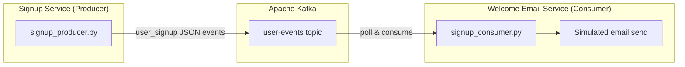

# Topic 09 — Mini Final Demo: User Signup Event Pipeline

## Project overview

A small **event-driven application** that mirrors a real-world user registration flow:

1. **Signup Service** (`signup_producer.py`) — registers new users and publishes `user_signup` events
2. **Kafka** (`user-events` topic) — durable event bus between services
3. **Welcome Email Service** (`signup_consumer.py`) — receives signups and simulates sending welcome emails

The signup service never calls the email service directly. They communicate **only through Kafka**.

---

## Architecture



---

## Signup event schema

```json
{
  "event_type": "user_signup",
  "event_id": "evt-a1b2c3d4",
  "user_id": "u-2001",
  "name": "Alice Smith",
  "email": "alice@example.com",
  "plan": "free",
  "timestamp": "2026-06-10T14:00:00Z"
}
```

---

## Quick start

### 1. Start Kafka

```powershell
cd d:\Work\data-science-projects\kafka-producer-consumer
docker compose up -d
```

### 2. Setup Python

```powershell
cd d:\Work\data-science-projects\kafka-producer-consumer-system\topic-09-mini-final-demo
py -3.12 -m venv .venv
.\.venv\Scripts\Activate.ps1
pip install -r requirements.txt
```

### 3. Reset consumer group (fresh demo)

```powershell
docker exec kafka /opt/kafka/bin/kafka-consumer-groups.sh `
  --bootstrap-server localhost:9092 `
  --group welcome-email-service `
  --delete
```

### 4. Run the pipeline

**Terminal 1 — Welcome Email Service (start first):**

```powershell
python signup_consumer.py
```

**Terminal 2 — Signup Service:**

```powershell
python signup_producer.py
```

Or use the demo script for setup:

```powershell
.\run-demo.ps1
```

---

## Expected output

### Producer (Terminal 2)

```
==================================================
  USER SIGNUP SERVICE — Event Producer
==================================================

Registering: Alice Smith (alice@example.com)
12:00:01 [INFO] Signup published | user=Alice Smith | email=alice@example.com | ...

Registering: Bob Jones (bob@example.com)
...

==================================================
  5/5 signup events published to 'user-events'
==================================================
```

### Consumer (Terminal 1)

```
──────────────────────────────────────────────────
  NEW USER SIGNUP RECEIVED
──────────────────────────────────────────────────
  Event ID  : evt-a1b2c3d4
  User ID   : u-2001
  Name      : Alice Smith
  Email     : alice@example.com
  Plan      : free
  Timestamp : 2026-06-10T14:00:00Z
──────────────────────────────────────────────────
  [EMAIL] Composing welcome email for Alice...
  [EMAIL] To      : alice@example.com
  [EMAIL] Subject : Welcome to our platform, Alice!
  [EMAIL] Body    : Hi Alice, thanks for signing up! Your free plan is now active.
  [EMAIL] Status  : SENT
```

Five users are registered per producer run.

---

## Demo recording checklist

Record a short screen capture showing the full pipeline:

| Step | Action | What to show |
|------|--------|--------------|
| 1 | Start Kafka | `docker compose ps` — kafka running |
| 2 | Terminal 1 | Run `signup_consumer.py` — service waiting |
| 3 | Terminal 2 | Run `signup_producer.py` — 5 users registered |
| 4 | Terminal 1 | Signup events received + welcome emails sent |
| 5 | Optional | Run producer again — only new signups processed |

**Screenshots to save:**

| File | Content |
|------|---------|
| `screenshots/01-consumer-waiting.png` | Consumer started, waiting for events |
| `screenshots/02-producer-signups.png` | Producer registering 5 users |
| `screenshots/03-consumer-emails.png` | Consumer showing user info + welcome emails |
| `screenshots/04-pipeline-overview.png` | Both terminals side by side |

---

## Test multiple users

The producer registers **5 users** per run:

| User | Email | Plan |
|------|-------|------|
| Alice Smith | alice@example.com | free |
| Bob Jones | bob@example.com | pro |
| Carol Lee | carol@example.com | free |
| David Kim | david@example.com | team |
| Eva Martinez | eva@example.com | free |

Run the producer multiple times to simulate ongoing registrations. The consumer processes each new signup and sends a welcome email.

---

## Why this is event-driven

| Traditional approach | Event-driven (this project) |
|---------------------|----------------------------|
| Signup API calls email API directly | Signup API publishes event to Kafka |
| Email failure blocks signup response | Signup completes; email service processes async |
| Adding SMS notifications requires changing signup code | New consumer subscribes to same topic |
| Services are tightly coupled | Services are independent and scalable |

---

## Deliverables

| Deliverable | File |
|-------------|------|
| Signup event producer | `signup_producer.py` |
| Welcome email consumer | `signup_consumer.py` |
| Demo guide | `demo-guide.md` (this file) |
| Architecture diagram | `pipeline-architecture.md` |
| Demo screenshots | `screenshots/` |

---

## Expected outcome

You can build a simple event-driven application: create structured signup events, publish them through Kafka, consume them in a separate service, display user information, and simulate downstream processing (welcome emails) — all without direct service-to-service calls.
