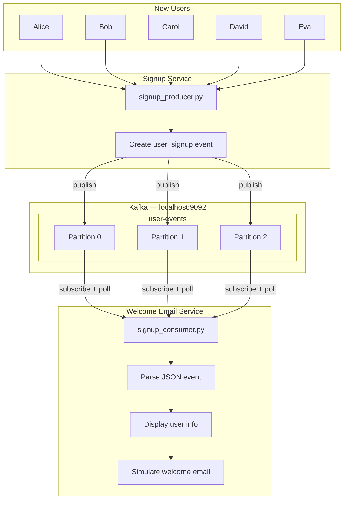
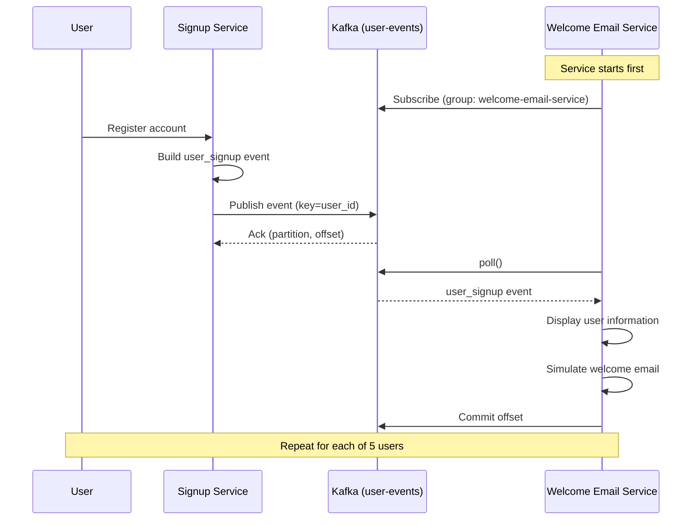

# Topic 09 — User Signup Pipeline Architecture

## System diagram



---

## Message flow sequence



---

## Event envelope

Every signup message follows the same structure:

```
┌─────────────────────────────────────────┐
│ event_type  : "user_signup"  (router)   │
│ event_id    : unique id per event       │
│ user_id     : partition key             │
│ name        : display name              │
│ email       : welcome email recipient   │
│ plan        : subscription tier         │
│ timestamp   : ISO-8601 UTC              │
└─────────────────────────────────────────┘
```

The consumer filters on `event_type == "user_signup"` and ignores other event types on the same topic.

---

## ASCII overview

```
  NEW USERS                SIGNUP SERVICE              KAFKA                EMAIL SERVICE
  ─────────                ──────────────              ─────                ─────────────

  Alice  ──┐
  Bob    ──┤
  Carol  ──┼──▶  signup_producer.py  ──▶  user-events  ──▶  signup_consumer.py
  David  ──┤         │                      topic              │
  Eva    ──┘         │                      │                  ├─ Display user info
                     │                      │                  └─ Send welcome email
                     └─ user_signup JSON events (5 per run)
```

---

## Scaling path (real world)

This demo uses one producer and one consumer. In production:

| Component | Scale approach |
|-----------|----------------|
| Signup Service | Multiple instances behind a load balancer |
| Kafka topic | More partitions for higher throughput |
| Email Service | Consumer group with N instances (one partition each) |
| New features | Add consumers for analytics, CRM sync, fraud checks — same topic |

---

## Related files

- [demo-guide.md](demo-guide.md) — run instructions and demo recording
- [signup_producer.py](signup_producer.py)
- [signup_consumer.py](signup_consumer.py)
