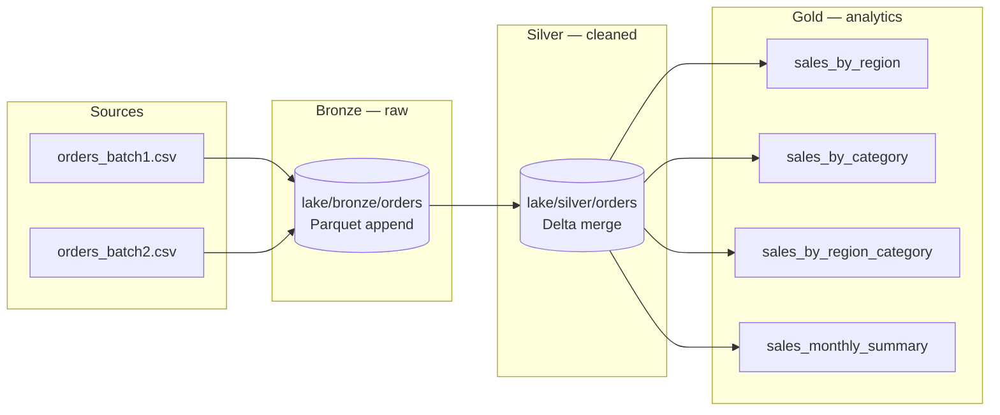

# Lakehouse Medallion Architecture

A PySpark lakehouse that implements the **Bronze → Silver → Gold** medallion pattern with **Parquet** and **Delta Lake** storage on local disk.

## Architecture



### Layer responsibilities

| Layer | Purpose | Format | Write mode | Key transforms |
|-------|---------|--------|------------|----------------|
| **Bronze** | Immutable raw landing zone | Parquet | Append | Add `_source_file`, `_ingested_at`; preserve source columns |
| **Silver** | Cleaned, typed, deduplicated orders | Delta | Merge on `order_id` | Cast types, filter invalid rows, compute `line_total`, dedupe by latest `ingested_at` |
| **Gold** | Business-facing aggregates | Delta + Parquet | Overwrite | `groupBy` / `agg` marts for region, category, and monthly KPIs |

### Design decisions

- **Bronze uses Parquet append** — cheap, append-only ingestion with no schema enforcement; mirrors a landing zone.
- **Silver uses Delta merge** — ACID upserts when batch 2 corrects order `1017` (price change) without duplicating rows.
- **Gold writes both Delta and Parquet** — Delta for lake-native consumers; Parquet for BI tools or file-based exports.

## Project layout

```
lakehouse-medallion-architecture/
├── README.md
├── requirements.txt
├── config.py                  # Lake paths and format constants
├── spark_session.py           # Spark + Delta session factory
├── pipeline.py                # End-to-end Bronze → Silver → Gold runner
├── data/
│   ├── orders_batch1.csv      # Initial 20 orders
│   └── orders_batch2.csv      # Incremental batch (incl. corrected order 1017)
├── pipelines/
│   ├── bronze_ingest.py       # Step 1: CSV → Bronze Parquet
│   ├── silver_transform.py    # Step 2: Bronze → Silver Delta
│   └── gold_aggregate.py      # Step 3: Silver → Gold marts
└── lake/                      # Runtime storage (gitignored)
    ├── bronze/orders/
    ├── silver/orders/
    └── gold/
```

## Prerequisites

- **Python 3.10–3.12** (PySpark 3.5+)
- **Java 8 or 11** (required by Spark). Set `JAVA_HOME` if Spark cannot find Java.

## Setup

```powershell
cd lakehouse-medallion-architecture
py -3.12 -m venv .venv
.\.venv\Scripts\Activate.ps1
pip install -r requirements.txt
```

## Run the pipeline

```powershell
python pipeline.py
```

Re-running appends new Bronze batches and merges updates into Silver. Delete `lake/` for a clean full reload.

## Pipeline steps

| Step | Layer | Description | Key APIs |
|------|-------|-------------|----------|
| 1 | Bronze | Ingest `data/orders_batch*.csv` with metadata | `spark.read.csv()`, `write.format("parquet").mode("append")` |
| 2 | Silver | Clean, validate, dedupe, merge by `order_id` | `withColumn()`, `filter()`, `DeltaTable.merge()` |
| 3 | Gold | Aggregate KPIs for BI and reporting | `groupBy()`, `agg()`, `write.format("delta")`, `write.format("parquet")` |
| 4 | Storage | Persist each layer in Parquet and/or Delta | See `config.py` format constants |
| 5 | Docs | Architecture diagram and layer contracts | This README |

## Incremental demo

`orders_batch2.csv` adds two new orders and re-sends order `1017` with an updated `unit_price` (949.99). After a full run:

- **Bronze** holds 23 raw rows (20 + 3 appended).
- **Silver** holds 22 unique orders — order `1017` keeps the latest price from batch 2.
- **Gold** marts reflect the corrected totals.

## Output tables

| Gold table | Description |
|------------|-------------|
| `lake/gold/sales_by_region/` | Total sales, units, and orders per region |
| `lake/gold/sales_by_category/` | Metrics per product category |
| `lake/gold/sales_by_region_category/` | Sales by region and category |
| `lake/gold/sales_monthly_summary/` | Monthly revenue and order counts |

Each mart is written twice: as **Delta** under `lake/gold/<name>/` and as **Parquet** under `lake/gold/<name>_parquet/`.

## Query Gold tables (optional)

```powershell
python -c "
from spark_session import create_spark_session
spark = create_spark_session('QueryGold')
spark.read.format('delta').load('lake/gold/sales_by_region').show()
spark.stop()
"
```
