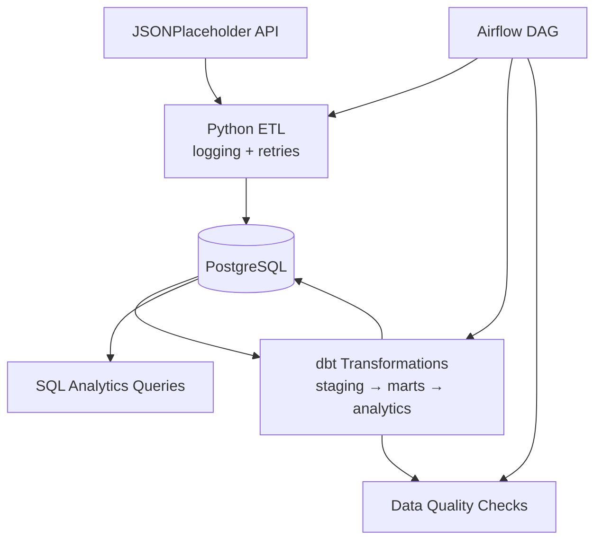

# Production-Style Data Engineering Portfolio Project

End-to-end data platform that ingests [JSONPlaceholder](https://jsonplaceholder.typicode.com) users and posts, loads them into PostgreSQL, transforms with **dbt**, orchestrates with **Apache Airflow**, and validates with **dbt tests** plus custom SQL quality checks.

## Architecture



| Layer | Responsibility |
|-------|----------------|
| **API** | Source of truth for users and posts |
| **Python ETL** | Extract, clean, upsert into `raw` schema |
| **PostgreSQL** | Warehouse (`raw`, `staging`, `marts`, `analytics`) |
| **dbt** | Staging views, dimension/fact tables, analytics mart |
| **Airflow** | Daily orchestration with retries |
| **Quality** | dbt tests + Python/SQL validations |
| **Analytics SQL** | Business-facing queries in `sql/analytics/` |

## Project layout

```
production-de-portfolio/
├── airflow/dags/production_etl_dag.py
├── dbt/                          # dbt project (models + tests)
├── docker/                       # Dockerfiles for ETL and Airflow
├── etl/                          # Python ETL package
├── postgres/init/                # Schema bootstrap
├── scripts/run_quality_checks.py
├── sql/analytics/                # Ad-hoc analytics SQL
├── docker-compose.yml
└── README.md
```

## Quick start (Docker)

**Prerequisites:** Docker Desktop, Docker Compose v2

```powershell
cd production-de-portfolio
copy .env.example .env

# Start Postgres, run ETL once, init Airflow, start scheduler + UI
docker compose up -d postgres postgres-init-airflow-db
docker compose run --rm etl
docker compose up -d airflow-init
docker compose up -d airflow-webserver airflow-scheduler
```

| Service | URL / port |
|---------|------------|
| Airflow UI | http://localhost:8080 (admin / admin) |
| PostgreSQL | `localhost:5433` (db: `de_portfolio`, user: `de_user`) |

Trigger the DAG **`production_de_portfolio`** in the Airflow UI, or run the full stack:

```powershell
docker compose up -d --build
docker compose run --rm etl
```

Run dbt manually inside the Airflow image:

```powershell
docker compose run --rm airflow-scheduler bash -c "cd /opt/airflow/dbt && dbt run --profiles-dir . && dbt test --profiles-dir ."
```

## Local development (without Airflow)

```powershell
cd production-de-portfolio
py -3.12 -m venv .venv
.\.venv\Scripts\Activate.ps1
pip install -r requirements-etl.txt
pip install dbt-core dbt-postgres

# Start only Postgres
docker compose up -d postgres

$env:POSTGRES_HOST="localhost"
$env:POSTGRES_PORT="5433"
python -m etl.pipeline

cd dbt
dbt run --profiles-dir .
dbt test --profiles-dir .
cd ..

$env:POSTGRES_PORT="5433"
python scripts/run_quality_checks.py
```

## Features

| Feature | Implementation |
|---------|----------------|
| **Logging** | `etl/logging_setup.py` — console + `logs/etl.log` |
| **Retries** | `tenacity` on API calls; Airflow `default_args` + task retries |
| **dbt tests** | `unique`, `not_null`, `relationships`, custom SQL test |
| **Docker** | `docker-compose.yml` + ETL/Airflow images |
| **Data quality** | `scripts/run_quality_checks.py` (row counts, orphans, freshness) |
| **Analytics SQL** | `sql/analytics/*.sql` |

## Analytics examples

```sql
-- Run against de_portfolio after dbt run
\i sql/analytics/user_activity_report.sql
```

Tables produced by dbt:

- `staging.stg_users`, `staging.stg_posts`
- `marts.dim_users`, `marts.fct_posts`
- `analytics.analytics_post_metrics`

## Airflow DAG

`production_de_portfolio` runs daily:

1. `run_python_etl` — extract/load to `raw`
2. `dbt_run` — build staging, marts, analytics
3. `dbt_test` — schema and relationship tests
4. `run_data_quality_checks` — post-load validations

## Environment variables

See `.env.example`. Key variables:

| Variable | Default |
|----------|---------|
| `POSTGRES_HOST` | `postgres` (Docker) / `localhost` (local) |
| `POSTGRES_PORT` | `5432` (Docker) / `5433` (host mapped) |
| `JSONPLACEHOLDER_BASE_URL` | `https://jsonplaceholder.typicode.com` |

## License

MIT — portfolio / educational use.
