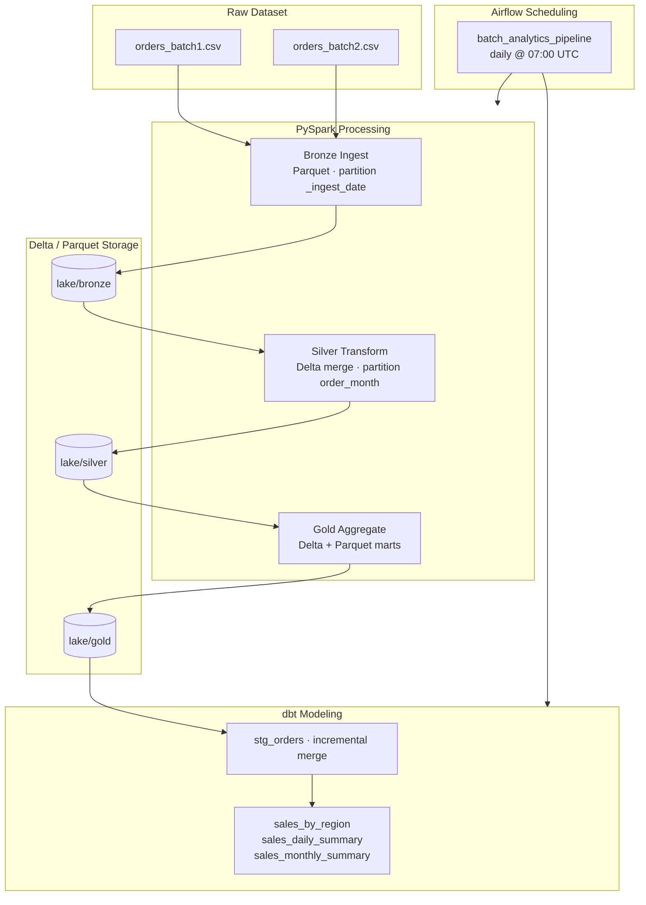

# Scalable Batch Analytics Pipeline

A production-style batch analytics pipeline powered by **PySpark**, **Delta Lake**, **dbt**, and **Apache Airflow**. Raw order CSVs flow through a **medallion architecture** (Bronze → Silver → Gold), with partitioning, incremental processing, validation gates, structured logging, and scheduled orchestration.

## Architecture



### Layer responsibilities

| Layer | Purpose | Format | Write mode | Partitioning |
|-------|---------|--------|------------|--------------|
| **Bronze** | Immutable raw landing zone | Parquet | Append (incremental batches) | `_ingest_date` |
| **Silver** | Cleaned, typed, deduplicated orders | Delta | Merge on `order_id` | `order_month` |
| **Gold** | Business-facing aggregates | Delta + Parquet | Overwrite | `order_month` on `order_detail` |
| **dbt** | Analytics tables for BI | DuckDB tables | Incremental staging + table marts | — |

## Features

| Feature | Implementation |
|---------|----------------|
| **Medallion architecture** | Bronze / Silver / Gold layers under `lake/` |
| **Partitioning** | Bronze by ingest date, Silver/Gold detail by order month |
| **Incremental processing** | Batch manifest tracks ingested files; Silver Delta merge; dbt incremental models |
| **Logging** | Structured logs in `logs/` + JSONL audit trail in `logs/pipeline_runs.jsonl` |
| **Validation** | Spark checks at raw/silver/gold layers; dbt schema + singular tests |
| **Orchestration** | Airflow DAG with task groups, retries, and failure callbacks |

## Project layout

```
scalable-batch-analytics-pipeline/
├── README.md
├── requirements.txt
├── config.py                     # Lake paths, partition columns, constants
├── logging_config.py             # Structured logging helpers
├── spark_session.py              # Spark + Delta session factory
├── pipeline.py                   # End-to-end Spark orchestrator
├── validate.py                   # Standalone validation runner
├── data/
│   ├── orders_batch1.csv         # Initial 20 orders
│   └── orders_batch2.csv         # Incremental batch (incl. corrected order 1017)
├── spark/
│   ├── bronze_ingest.py          # Incremental CSV → Bronze Parquet
│   ├── silver_transform.py       # Bronze → Silver Delta + Parquet export
│   ├── gold_aggregate.py         # Silver → Gold marts
│   └── validation.py             # Data quality checks
├── dbt/
│   ├── dbt_project.yml
│   ├── profiles.yml              # DuckDB target
│   ├── models/staging/stg_orders.sql
│   └── models/marts/             # Analytics tables
├── dags/
│   └── batch_analytics_dag.py    # Airflow orchestration DAG
├── scripts/
│   ├── setup.ps1                 # venv + Airflow init
│   ├── run_pipeline.ps1          # Spark + dbt end-to-end
│   └── run_dag.ps1               # Test Airflow DAG locally
├── state/
│   └── batch_manifest.json       # Tracks processed CSV batches
└── lake/                         # Runtime storage (gitignored)
```

## Prerequisites

- **Python 3.10–3.12** (PySpark 3.5+, dbt, Airflow)
- **Java 8 or 11** (required by Spark). Set `JAVA_HOME` if Spark cannot find Java.

## Setup

```powershell
cd scalable-batch-analytics-pipeline
.\scripts\setup.ps1
```

Or manually:

```powershell
py -3.12 -m venv .venv
.\.venv\Scripts\Activate.ps1
pip install -r requirements.txt
$env:AIRFLOW_HOME = (Get-Location).Path
airflow db migrate
```

## Run the pipeline

### Spark medallion pipeline only

```powershell
python pipeline.py
```

Re-running skips batches already recorded in `state/batch_manifest.json`. Use `--force-all` to re-ingest every batch.

### Spark + dbt (full analytics stack)

```powershell
.\scripts\run_pipeline.ps1
```

### Validation only

```powershell
python validate.py --layer all
python validate.py --layer silver
```

### dbt only (after Spark has populated the lake)

```powershell
cd dbt
$env:DBT_PROFILES_DIR = (Get-Location).Path
dbt run
dbt test
dbt docs generate
dbt docs serve
```

### Airflow DAG (local test)

```powershell
$env:AIRFLOW_HOME = (Get-Location).Path
.\scripts\run_dag.ps1
```

## Pipeline flow

| Step | Component | Description |
|------|-----------|-------------|
| 1 | Validation | Check raw CSV schema and value constraints |
| 2 | Bronze | Incrementally append CSV batches to partitioned Parquet |
| 3 | Silver | Clean, dedupe, merge into partitioned Delta; export Parquet for dbt |
| 4 | Gold | Build regional, category, monthly, and order-detail marts |
| 5 | Validation | Post-transform Silver and Gold quality gates |
| 6 | dbt | Incremental staging + analytics marts in DuckDB |
| 7 | Airflow | Schedule and orchestrate the full flow daily |

## Incremental demo

`orders_batch2.csv` adds two new orders and re-sends order `1017` with an updated `unit_price` (949.99). After a full run:

- **Bronze** holds 23 raw rows (20 + 3 appended across batches).
- **Silver** holds 22 unique orders — order `1017` keeps the latest price from batch 2.
- **Gold** marts reflect the corrected totals.
- **dbt** `stg_orders` merges only new/changed records incrementally.

Delete `lake/` and reset `state/batch_manifest.json` to `{"processed_files": []}` for a clean full reload.

## Output tables

### Gold (Spark)

| Table | Path | Description |
|-------|------|-------------|
| `sales_by_region` | `lake/gold/sales_by_region/` | Sales KPIs per region |
| `sales_by_category` | `lake/gold/sales_by_category/` | Metrics per product category |
| `sales_by_region_category` | `lake/gold/sales_by_region_category/` | Cross-tab sales |
| `sales_monthly_summary` | `lake/gold/sales_monthly_summary/` | Monthly revenue rollup |
| `order_detail` | `lake/gold/order_detail/` | Line-level order facts (partitioned) |

Each mart is also exported as **Parquet** under `lake/gold/<name>_parquet/`.

### Analytics (dbt → DuckDB)

| Model | Materialization | Description |
|-------|-----------------|-------------|
| `stg_orders` | Incremental merge | Staged orders from Silver Parquet |
| `sales_by_region` | Table | Regional KPIs for dashboards |
| `sales_daily_summary` | Incremental merge | Daily revenue and order counts |
| `sales_monthly_summary` | Table | Monthly rollup from staging |

## Logging and monitoring

- **Stage logs**: `logs/bronze_ingest.log`, `logs/silver_transform.log`, `logs/gold_aggregate.log`, `logs/pipeline.log`
- **Audit trail**: `logs/pipeline_runs.jsonl` — one JSON record per pipeline stage
- **Airflow metrics**: `logs/airflow_metrics/dag_runs.jsonl` — DAG completion and failure events

## Query examples

```powershell
# Gold regional sales via Spark
python -c "
from spark_session import create_spark_session
spark = create_spark_session('QueryGold')
spark.read.format('delta').load('lake/gold/sales_by_region').show()
spark.stop()
"

# dbt marts via DuckDB CLI (after dbt run)
# duckdb dbt/analytics.duckdb -c 'SELECT * FROM main.sales_by_region'
```
